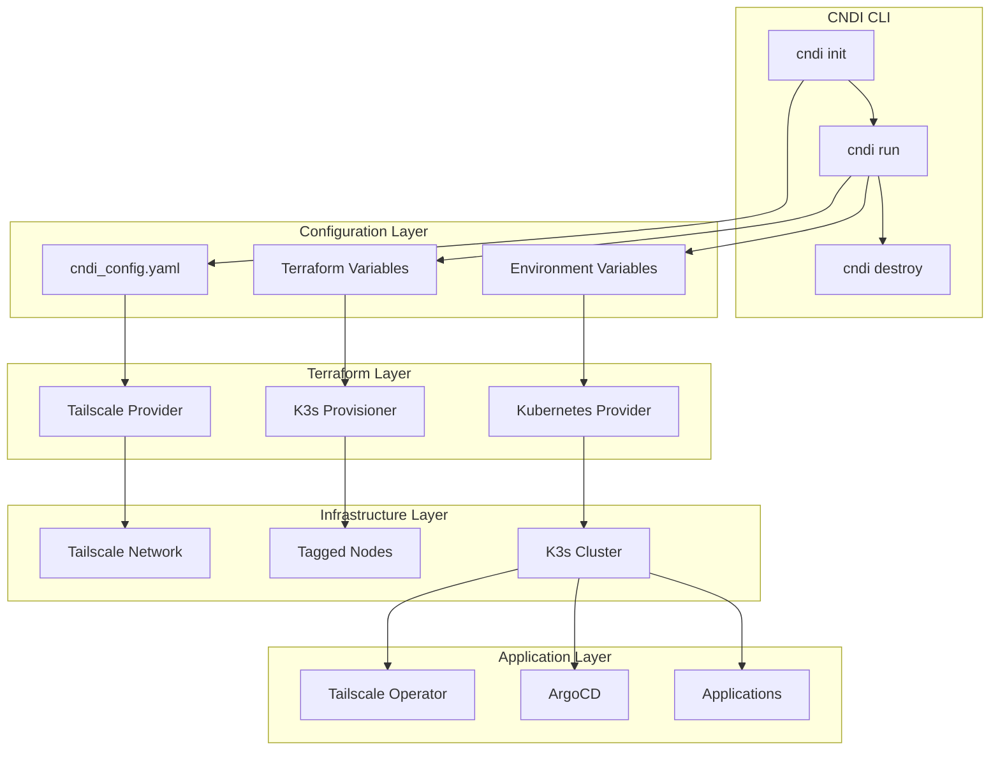

# Design Document

## Overview

The bare/k3s deployment target extends CNDI's existing infrastructure-as-code
approach to support lightweight Kubernetes clusters using k3s across bare metal
or virtual machines connected via Tailscale. This design integrates seamlessly
with CNDI's current Terraform-based workflow while introducing new components
for k3s cluster management and Tailscale networking.

The implementation follows CNDI's established patterns for deployment targets,
extending the existing provider/distribution model to include `bare` as a
provider and `k3s` as a distribution. This maintains consistency with existing
targets like `aws/eks`, `gcp/gke`, and `azure/aks`.

## Architecture

### High-Level Architecture



### Component Integration

The bare/k3s target integrates with CNDI's existing architecture through:

1. **Type System Extension**: Adding `bare` to `CNDIProvider` and `k3s` to
   `CNDIDistribution`
2. **Template System**: Creating blocks for bare/k3s configuration and prompts
3. **Terraform Generation**: Extending the output system to generate
   k3s-specific Terraform
4. **Command Integration**: Leveraging existing `cndi init`, `cndi run`, and
   `cndi destroy` workflows

## Components and Interfaces

### 1. Configuration Schema Extensions

**CNDIProvider Type Extension**

```typescript
export type CNDIProvider = "aws" | "azure" | "gcp" | "dev" | "bare";
```

**CNDIDistribution Type Extension**

```typescript
export type CNDIDistribution =
  | "microk8s"
  | "eks"
  | "gke"
  | "aks"
  | "clusterless"
  | "k3s";
```

### 2. Terraform Provider Integration

**Tailscale Provider Configuration**

- Uses the official Tailscale Terraform provider
- Authenticates using API key or OAuth token
- Discovers nodes based on configured tags
- Manages node access and permissions

**K3s Provisioning Module**

- Custom Terraform module for k3s installation
- Uses SSH for node configuration
- Handles control plane and worker node setup
- Manages cluster token distribution

**Kubernetes Provider Integration**

- Connects to k3s cluster using generated kubeconfig to deploy pre-GitOps apps
  like ArgoCD

### 3. Node Discovery and Selection

**_auto_ Node Selection Algorithm**

- Query Tailscale API for nodes matching `tag:cndi--*`
- Sort by discovered IPv4 addresses
- First node in sorted list is `leader` when
  `cndi_config.yaml[infrastructure][cndi][nodes] = 'auto'`
- All other nodes are workers

### 4. Node list specified

- Nodes have a `host` field which is a MagicDNS address or a 100.x.x.x IPv4
  address
- Nodes `address` field will be deprecated
- Nodes have a `name`
- Nodes may have a `role` of `controller`|`worker` and only one `leader`

### 4. K3s Cluster Provisioning

**Control Plane Setup**

- Install k3s in server mode on the `leader`
- Configure cluster with Tailscale networking
- Generate and distribute cluster token
- Set up kubeconfig for external access

**Worker Node Setup**

- Install k3s in agent mode on remaining nodes
- Join cluster using control plane endpoint and token
- Configure networking through Tailscale

**Cluster Validation**

- Verify all nodes are ready and connected
- Test inter-node communication
- Validate DNS and networking functionality

## Data Models

### Configuration Data Model

```yaml
# cndi_config.yaml for bare/k3s
cndi_version: v3
project_name: my-k3s-cluster
provider: bare
distribution: k3s
infrastructure:
  tailscale:
    tailnet: example-platypus.ts.net
  cndi:
    nodes: auto # selects tag:cndi--my-k3s-cluster
    argocd:
      hostname: "argocd.my-cluster.ts.net"
applications: {}
cluster_manifests: {}
```

```yaml
# cndi_config.yaml for bare/k3s with manual nodes
cndi_version: v3
project_name: my-k3s-cluster
provider: bare
distribution: k3s
infrastructure:
  tailscale:
    tailnet: example-platypus.ts.net
  cndi:
    nodes:
      - name: alpha
        host: mynode.something
        role: leader
      - name: beta
        host: 100.40.40.40
    argocd:
      hostname: "argocd.my-cluster.ts.net"
applications: {}
cluster_manifests: {}
```

```yaml
# cndi_config.yaml for bare/k3s with tag specified
cndi_version: v3
project_name: my-k3s-cluster
provider: bare
distribution: k3s
infrastructure:
  tailscale:
    tailnet: example-platypus.ts.net
  cndi:
    nodes:
      - name: alpha
        role: leader
        tag: tag:leader-node
    argocd:
      hostname: "argocd.my-cluster.ts.net"
applications: {}
cluster_manifests: {}
```

```dotenv
# used by terraform to provision cluster of tailscale nodes
SSH_PRIVATE_KEY='...' 
TAILSCALE_OAUTH_CLIENT_ID='...'
TAILSCALE_OAUTH_CLIENT_SECRET='...'
```

### Terraform State Model

The Terraform state will track:

- Tailscale node list
- Scripts which bootstrap cluster leaders and workers over SSH
- Cluster credentials and endpoints

## Error Handling

### Node Discovery Errors

- **Insufficient Nodes**: Clear error message with minimum requirements
- **Tailscale API Errors**: Retry logic with exponential backoff
- **Authentication Failures**: Detailed guidance on auth key configuration

### Provisioning Errors

- **SSH Connection Failures**: Node-specific error reporting
- **K3s Installation Failures**: Detailed logs and rollback procedures
- **Network Configuration Errors**: Validation and troubleshooting steps

### Cluster Health Monitoring

- **Node Readiness Checks**: Continuous monitoring during provisioning
- **Network Connectivity Tests**: Inter-node communication validation
- **Service Health Verification**: Core component status checks

### Recovery Procedures

- **Partial Failure Recovery**: Ability to retry failed nodes
- **Cluster Repair**: Detection and remediation of configuration drift
- **Clean Destruction**: Proper cleanup of all resources on destroy

## Testing Strategy

### Unit Testing

- **Configuration Validation**: Test schema validation and type checking
- **Node Selection Logic**: Test tag filtering and resource validation
- **Terraform Generation**: Test output generation for various configurations

### Integration Testing

- **Tailscale Integration**: Test node discovery and authentication
- **K3s Provisioning**: Test cluster creation and configuration
- **Operator Deployment**: Test Tailscale operator installation

### End-to-End Testing

- **Full Deployment Workflow**: Test complete `cndi init` → `cndi run` →
  `cndi destroy` cycle
- **Application Deployment**: Test deploying sample applications
- **Network Functionality**: Test DNS, ingress, and TLS functionality

### Test Environment Setup

- **Mock Tailscale API**: For unit and integration testing
- **Test Node Pool**: Dedicated VMs for E2E testing
- **CI/CD Integration**: Automated testing in GitHub Actions

### Performance Testing

- **Cluster Provisioning Time**: Measure deployment duration
- **Resource Utilization**: Monitor CPU, memory, and network usage
- **Scalability Testing**: Test with varying node counts

### Security Testing

- **Network Isolation**: Verify Tailscale network security
- **Certificate Management**: Test TLS certificate provisioning
- **Access Control**: Verify RBAC and authentication mechanisms
