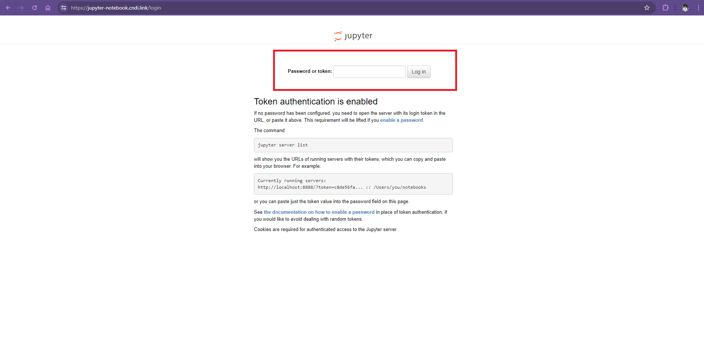
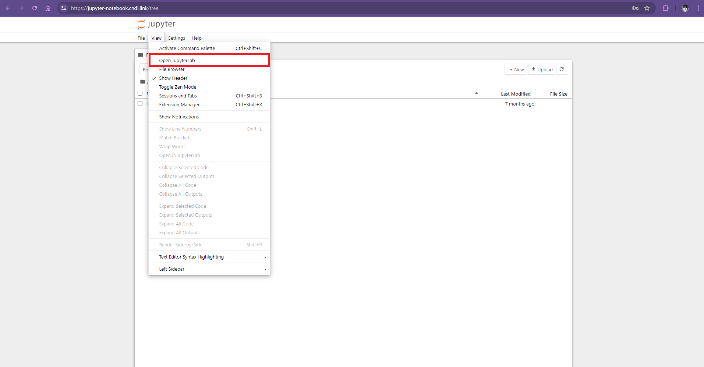
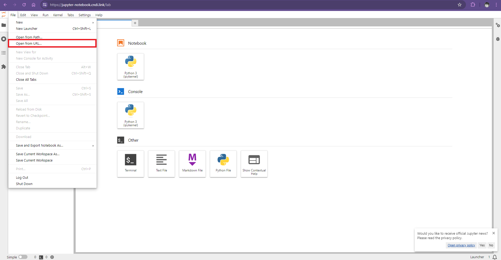
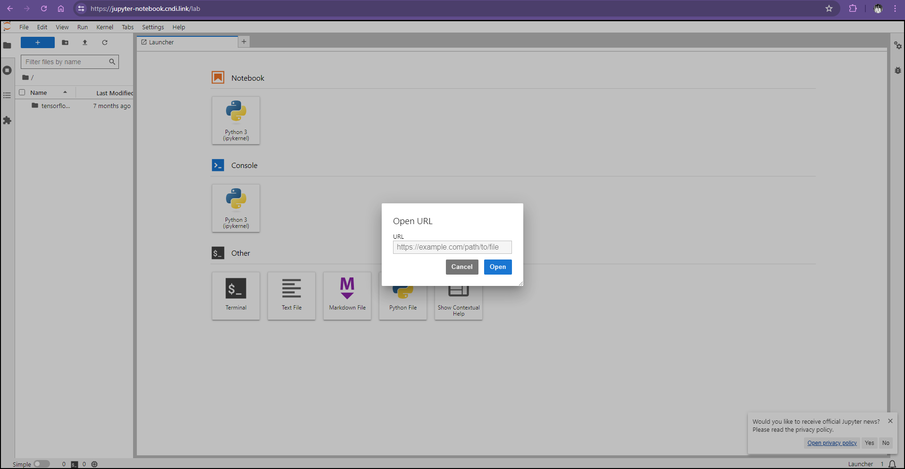
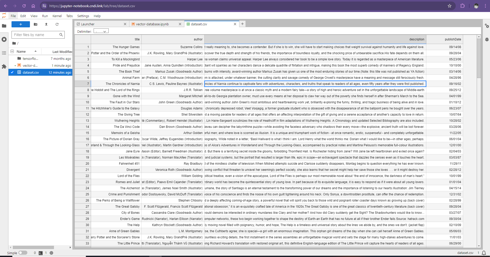
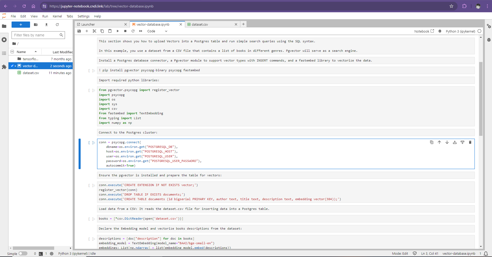
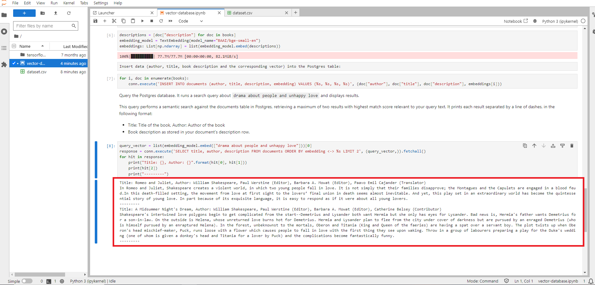
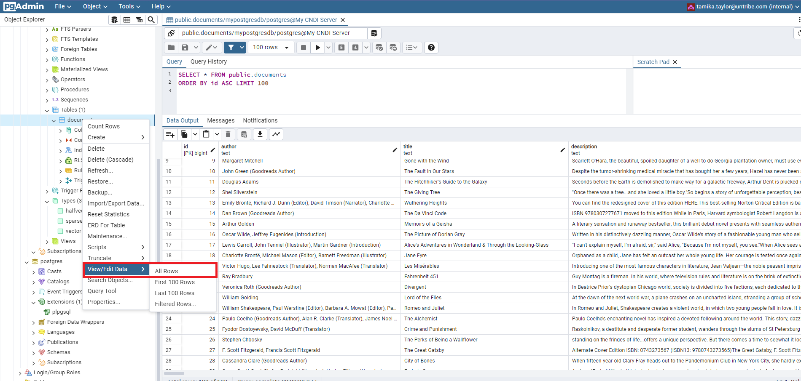
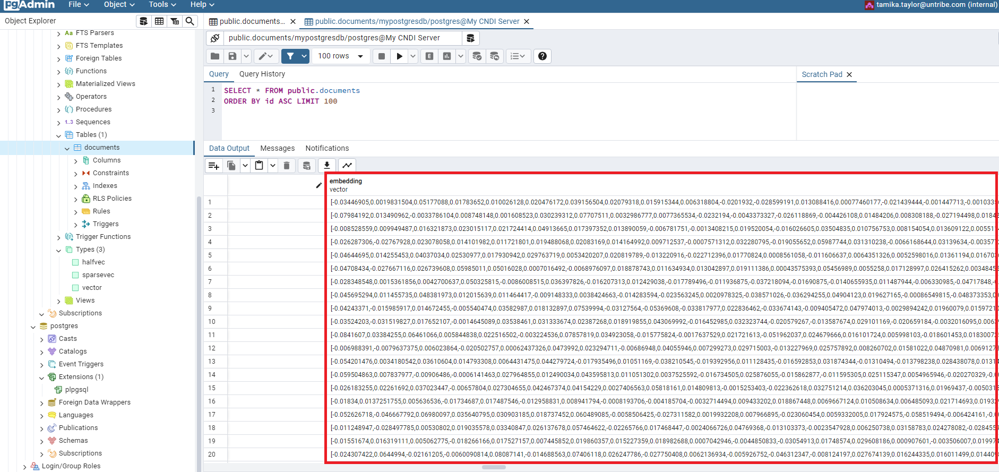

# Deploying PostgreSQL Vector Database on EKS using CNDI

## overview 🔭

In the realm of modern applications, the need for efficient and scalable databases that can handle complex data types such as vectors is increasing. PostgreSQL, with its extensive range of modules and extensions, has become a go-to solution for such needs. One notable extension is pgvector, which enables storing and querying vectors within PostgreSQL tables. This tutorial walks you through deploying a GitOps-enabled PostgreSQL vector database cluster on Amazon's Elastic Kubernetes Service (EKS) using CNDI.

## objectives

In this tutorial, you will:

1. **Install CNDI**: Learn how to install the CNDI tool to manage your
   cloud-native deployments.
2. **Deploy a PostgreSQL Vector Database Cluster on an EKS Cluster**: Set up a
   scalable and secure PostgreSQL vector database on Amazon's Elastic Kubernetes
   Service (EKS).
3. **Deploy a Jupyter Notebook on the EKS Cluster**: Launch a Jupyter Notebook
   instance on your EKS cluster for interactive data analysis.
4. **Upload Vectors into a PostgreSQL Vector Database Table and Run Semantic Search Queries**: Use Jupyter Notebook to load data, create vectors, and perform semantic searches against your PostgreSQL database.

## prerequisites ✅

**You will need the following things to get up and running with CNDI
successfully:**

- **AWS Cloud Account**: You'll need an active AWS account as CNDI deploys
  infrastructure within Amazon Web Services.

- **AWS Credentials**: CNDI requires your AWS Access Key ID and AWS Secret
  Access Key to authenticate and deploy resources. Learn how to obtain your
  credentials from the
  [official AWS documentation](https://docs.aws.amazon.com/IAM/latest/UserGuide/id_credentials_access-keys.html#Using_CreateAccessKey).

- **Domain Name**: For easy access to your cluster, attach a domain name to the
  load balancer. Provide this domain during the `cndi create` command, and CNDI
  will configure it automatically.

- **GitHub Account**: Manage your infrastructure's state using a GitOps
  workflow. Ensure you have a
  [GitHub account](https://docs.github.com/en/get-started/signing-up-for-github/signing-up-for-a-new-github-account)
  and a
  [GitHub Personal Access Token](https://docs.github.com/en/authentication/keeping-your-account-and-data-secure/creating-a-personal-access-token)
  set up.

- **GitHub CLI**: Install the GitHub Command Line Interface (CLI) to interact
  with GitHub from your terminal. Download it from the
  [GitHub CLI page](https://cli.github.com/).

- **AWS Setup Guide**: For a detailed guide on setting up your Amazon Web
  Services account, including roles and permissions, refer to our
  [AWS Setup Documentation](/docs/cloud-setup/aws/aws-setup.md).

## download cndi ⬇️

### macos and linux

```bash
curl -fsSL https://raw.githubusercontent.com/polyseam/cndi/main/install.sh | sh
```

### windows

```powershell
irm https://raw.githubusercontent.com/polyseam/cndi/main/install.ps1 | iex
```

## create your cndi project 📂

CNDI uses a GitOps workflow. Let's create your project:

```shell
# cndi create <owner>/<repo> && cd <repo>

 cndi create polyseam/my-cndi-cluster && cd my-cndi-cluster
```

Follow the prompts to set up your project:

- **Please confirm the destination directory for your CNDI project**: _directory
  for your CNDI project_
- **Please enter a name for your CNDI project**: _Provide a unique name for your
  CNDI project._
- **Pick a template**: _list of templates to choose from_
- **Where do you want to deploy your cluster**: _Specify the cloud provider
  where you want to deploy your Kubernetes cluster._
- **Select a distribution**:_Which distribution would you like to use? (e.g.,
  eks, gke, aks)_
- **Would you like ArgoCD to connect to your repo using a Git token or SSH
  key?**: _Choose the authentication method to connect to your Git repository._
- **What is your git username?**: _Enter your Git username for repository
  access._
- **Please enter your Git Personal Access Token**: _Provide your Git Personal
  Access Token for secure repository access._
- **GitHub Repository URL**: _Enter the URL of your Git repository._
- **Email address you want to use for lets encrypt:** _Provide an email address
  used for registering Let's Encrypt certificates._
- **Would you like to enable external-dns for automatic DNS management?
  (Y/n)**:_Choose whether to enable automatic DNS management using
  external-dns._
- **Please select your DNS provider (azure)**:_Specify your DNS provider for
  managing DNS records._
- **Enter an override for the default ArgoCD Admin Password? (default: randomly
  generated value)**: _Optionally set a custom password for accessing ArgoCD's
  administrative interface._
- **AWS Access Key ID**: _Enter your AWS Access Key ID for accessing AWS
  services_.
- **AWS Secret Access Key**: _Provide your AWS Secret Access Key for secure AWS
  service access._
- **Please enter your AWS Region (default: us-east-1)**: _Specify the AWS region
  where your resources will be deployed._
- **Do you want to expose ArgoCD with an Ingress? (Y/n)**: _Decide whether to
  make PgAdmin accessible from the public internet._
- **What hostname should ArgoCD be accessible at**: _Enter the hostname through
  which ArgoCD will be accessed._
- **Do you want to install PgAdmin, a web-based database management
  tool(Y/n)**:_Choose whether to install PgAdmin for managing databases via a
  web interface_
- **Do you want to expose PgAdmin to the web(Y/n)**:_Decide whether to make
  PgAdmin accessible from the public internet._
- **What hostname should PGAdmin be accessible at?
  (default:pgadmin.example.com)**:_Enter the hostname through which PgAdmin will
  be accessed._
- **What email do you want to use for your PgAdmin login**:_Provide an email
  address used for logging into PgAdmin._
- **What password do you want to use for your PgAdmin login? (default: randomly
  generated value)**:_Set a password for logging into PgAdmin._
- **Do you want to expose PostgreSQL to the web? (Y/n)**:_Choose whether to make
  your PostgreSQL database accessible from the public internet._
- **What hostname should PostgreSQL be accessible at?
  (default:postgres.example.com)**:_Enter the hostname through which the
  PostgreSQL database will be accessed._
- **What username should be used for your PostgreSQL admin user?
  (default:postgres)**:_Specify the username for the PostgreSQL admin user._
- **What will be your default password for your PostgreSQL admin user?(default:
  randomly generated value)**:_Set a default password for the PostgreSQL admin
  user._
- **What will be the name for your PostgreSQL database? (default:postgres)**:
  _Enter the name for your PostgreSQL database_
- **What namespace should PostgreSQL be deployed in?
  (default:postgres)**:_Specify the Kubernetes namespace where PostgreSQL will
  be deployed._
- **What will be the name for your PostgreSQL cluster?
  (default:postgres-cluster)**: _Provide a name for your PostgreSQL cluster._

Once the prompts are all answered the process will generate a `cndi_config.yaml`
file, and `cndi` directory at the root of your repository containing all the
necessary files for the configuration. It will also store all the values in a
file called `.env` at the root of your repository.

The structure of the generated CNDI project will be something like this:

```shell
├── 📁 cndi
│   ├── 📁 cluster_manifests
│   │   ├── 📁 applications
│   │   │   ├── cnpg.application.yaml
|   |   |   ├── pgadmin.application.yaml
|   │   │   ├── public_nginx.application.yaml
|   │   │   └── etc
│   │   ├── argo-ingress.yaml
│   │   ├── cert-manager-cluster-issuer.yaml
│   │   └── etc
│   └── 📁 terraform
│       └── cdk.tf.json
├── cndi_config.yaml
├── .env
├── .gitignore
├── .github
└── README.md
```

## Deploying the Cluster 🚀

Once complete you should click on the link of the newly created repo cluster,
and scroll down to the readme for more information about your cnpg deployment

You should now see the cluster configuration has been uploaded to GitHub:


Now, open your web browser and navigate to your project on GitHub. Click on the
Actions tab, then click on the job that was triggered from your latest commit.

You will see something like the image below, which shows that GitHub has
successfully run the workflow.


It is common for `cndi run` to take a fair amount of time, as is the case with
most Terraform and cloud infrastructure deployments.

Once `cndi run` has been completed, at the end of the run will be a link to
`resource groups`, where you can view resources deployed by CNDI for this
project.


---

## Accessing Your Services 🌐

### Automatic DNS Setup with ExternalDNS

If you enabled ExternalDNS, your domain's DNS settings will be automatically
configured. Once the DNS changes propagate, you can access ArgoCD and PostgreSQL
using your domain names.


To log in, use the username `admin` and the password which is the value of the
`ARGOCD_ADMIN_PASSWORD` in the `.env` located in your CNDI project folder

<details >
<summary>
Manual DNS Setup (Optional)
</summary>
<div>
At the end of the cndi run there is also an output called `resource groups`,
which will have public loadbalancer.

- Copy the public IP of the load balancer.
- Create an A record in your domain registrar pointing to this IP.
- Open the domain names in your browser to access ArgoCD and PostgreSQL.


 If everything is
working correctly you should now open the domain name you've assigned for ArgoCD
in your browser to see the ArgoCD login page. The DNS changes may take a few
minutes to propagate.


To log in, use the username `admin` and the password which is the value of the
`ARGOCD_ADMIN_PASSWORD` in the `.env` located in your CNDI project folder

</div>

</details>

<br>
<details >
<summary>
No DNS Setup - Port forwarding (Optional)
</summary>
<div>
This guide will walk you through the process of connecting to your Elastic Kubernetes Service (EKS) cluster using the AWS CLI and then port forwarding the service for local access.

## Prerequisites

- [AWS CLI](https://docs.aws.amazon.com/cli/latest/userguide/getting-started-install.html)
  installed on your local machine.
- The Kubernetes command-line tool
  [kubectl](https://kubernetes.io/docs/tasks/tools/install-kubectl/) which
  allows you to run commands against Kubernetes clusters.

## Steps

**1.Install and Configure `AWS` CLI:**

If you haven't already, you'll need to install and configure the `AWS` CLI. You
can download and set it up by following the instructions in the
[AWS CLI install instructions](https://docs.aws.amazon.com/cli/latest/userguide/getting-started-install.html#getting-started-install-instructions).

**2.Configure Kubernetes CLI (kubectl):**

To interact with an Amazon Elastic Kubernetes Service (EKS) cluster, you need to
fetch the cluster's configuration. You can do this with the AWS CLI:

```bash
aws eks update-kubeconfig --name <cluster_name> --region <region>
```

Replace <cluster_name>, <region> with the actual name and region of your EKS
cluster.

## Port Forwarding the Services

To port forward the argocd web server to your local machine, use the kubectl
port-forward command. Replace <namespace> and <service-name> with the name of
the Argocd server service and <local-port> with the local port you want to use
(e.g., 8080):

```bash
## This is the format of the port fowarding command
kubectl port-forward -n <namespace> svc/<service-name> <local-port>:80
```

```bash
kubectl port-forward -n argocd svc/argocd-server 8080:80
```

**1. Access the Argocd Web UI:**

You will see a message similar to:

```
Forwarding from 127.0.0.1:8080 -> 8080
```

Let's open the port displayed in the browser:

eg: `http://127.0.0.1:8080`

You should now see a login page for Argocd, and a place to enter a username and
password. The username is `admin` and the password is available in the `.env`
file we created for you under the key `ARGOCD_ADMIN_PASSWORD`.


**2. Terminating the Port Forwarding Session:**

To terminate the port forwarding session, simply press Ctrl+C in your terminal
when you're done using the Argocd web UI.

To log in, use the username `admin` and the password which is the value of the
`ARGOCD_ADMIN_PASSWORD` in the `.env` located in your CNDI project folder

</div>

</details>
Once you are logged in verify all applications and manifests in the cluster are present and their status is healthy in the ArgoCD UI


## Testing Your PostgreSQL Connection

Ensure CloudNativePG is properly accessible through your chosen domain after
deploying and configuring external access.

### Using PostgreSQL Command Line Tool

Install an PostgreSQL client like `psql` to access your database `

#### Connect to the Database

Execute the command below, replacing placeholders with your postgresql host,
user and database name. You'll be prompted for the password.

```bash
psql -h <hostname> -p 5432 -U <username> -d <database>
```


The POSTGRESQL_CONNECTION_STRING and PSQL_CONNECTION_COMMAND can be found in the
.env file.

### Using PgAdmin (Optional)

PgAdmin offers a GUI for managing your PostgreSQL databases. To connect:

**Launch PgAdmin** and navigate to the dashboard.

Enter the login and email credentials. The `PGADMIN_LOGIN_PASSWORD`, and
`PGADMIN_LOGIN_EMAIL` can be found in the `.env` file. Through a connection
file, your database details are made automatically available, allowing you to
simply click on your server entry in PgAdmin's browser panel and enter your
postgres user admin password to connect to your database.


<<<<<<< HEAD

## Upload demo dataset and run search queries with Jupyter Notebook

In this section, you upload vectors into a PostgreSQL table and run semantic
search queries using SQL syntax.

In the following example, you use a dataset from a CSV file that contains a list
of books in different genres. Pgvector serves as a search engine, and the query
you run in your notebookserves as a client querying the PostgreSQL database.

### Login to Jupyter Notebook

Begin by logging into your Jupyter Notebook instance. This is your development
environment where you will run the necessary commands and scripts.



### Open JupyterHub

Navigate to JupyterHub to access your Jupyter environment.



### Load the Dataset and notebook file from URL


 Next, open the URL in the console and enter the
GitHub Repository URL containing the dataset CSV file. This file includes the
data that you will load into your PostgreSQL database.

```bash
https://raw.githubusercontent.com/Polyseam/cndi-examples-and-datasets/main/databases/postgres-pgvector/semantic-search/dataset.csv
```

This URL points to a CSV file that contains a list of books in various genres.
By loading this file, you will be able to use the data for your semantic search
queries.



After loading the dataset, you need to open the Jupyter Notebook file that
contains the code for processing the dataset and performing the semantic search.
Enter the following URL in the console:

```bash
https://raw.githubusercontent.com/Polyseam/cndi-examples-and-datasets/main/databases/postgres-pgvector/semantic-search/vector-database.ipynb
```

This notebook file includes all the necessary steps and code to set up the
vectors and run queries against your PostgreSQL database.




### Run the Jupyter Notebook

To run the entire notebook, click on Run in the menu, then select Run all cells.
This action will execute all the code cells in the notebook sequentially. The
notebook includes a query that performs a semantic search for the text "drama
about people and unhappy love" against the documents table in PostgreSQL

### Verify the Results

The output of the run is similar to the following:

_Title: Romeo and Juliet, Author: William Shakespeare, Paul Werstine (Editor),
Barbara A. Mowat (Editor), Paavo Emil Cajander (Translator) In Romeo and Juliet,
Shakespeare creates a violent world, in which two young people fall in love. In
part because of its exquisite language, it is easy to respond as if it were
about all young lovers._ --------_Title: A Midsummer Night's Dream, Author:
William Shakespeare, Paul Werstine (Editor), Barbara A. Mowat (Editor),
Catherine Belsey (Contributor) Shakespeare's intertwined love polygons begin to
get complicated from the start.Throw in a group of labourers preparing a play
for the Duke's wedding (one of whom is given a donkey's head and Titania for a
lover by Puck) and the complications become fantastically funny._



To ensure that the vectors were created correctly, you can use the pgAdmin tool
to verify the results.




### and you are done! ⚡️

# By following these steps, you now have a fully-configured 3-node Kubernetes cluster with a TLS-enabled PostgreSQL Database Cluster. This setup allows you to perform advanced semantic searches and ensures your data is stored securely.

## and you are done! ⚡️

You now have a fully-configured 3-node Kubernetes cluster with TLS-enabled
Postgresql Database Cluster

## modifying the cluster! 🛠️

**To add another a node to the cluster:**


- Go to the `cndi_config.yaml`
- In the `infrastructure.cndi.nodes` section, add a new cnpg node and save the
  file
- Run `cndi ow`
- `Add`, `commit` and `push` the config to your GitHub repository:

```shell
git add .
git commit -m "add instance"
git push
```

## destroying resources in the cluster! 💣

**If you just want to take down any of your individual applications:**

- Delete that application or manifest from your `cndi_config.yaml`
- Run `cndi ow`
- `Add`, `commit` and `push` the config to your GitHub repository:

```shell
git add .
git commit -m "destroy instance"
git push
```

<<<<<<< HEAD

## destroying ALL your resources! 💣

**If you want to take down the entire cluster and resources run:**

```bash
cndi destroy
```
